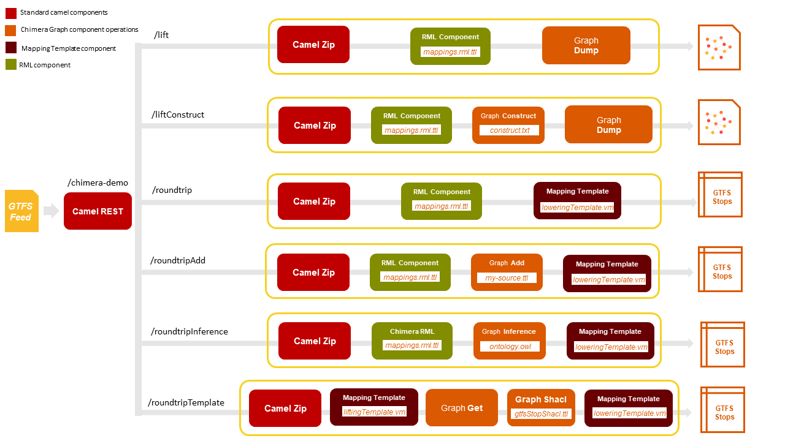

# Chimera Tutorial

The `chimera-tutorial` project offers a complete example to easily understand how to develop semantic data transformation pipelines using the [Chimera](https://github.com/cefriel/chimera) framework.

## TL;DR

1. Launch the `chimera-tutorial` pipelines with Docker
```
docker run -p 8888:8888 cefriel/chimera:tutorial
```
2. Run the routes described in the [Tutorial Routes](#Tutorial-Routes) to invoke the endpoints: (i) import the Postman collection, or (ii) run the `tutorial.sh` script with one of the following arguments: `lift`, `liftConstruct`, `roundtrip`, `roundtripAdd`, `roundtripInference`, `roundtripTemplate`. Each argument refers to one of the routes presented in section [Tutorial Routes](#Tutorial-Routes).
When using the included Postman collection remember to set the Body for each request to the file [sample-gtfs-feed.zip](./inbox/sample-gtfs-feed.zip)

## Chimera Route Components

The Chimera project specifies three different components.

1. The Chimera Graph Component

   The Chimera Graph Component specifies several operations that act on RDF Graphs.	
2. The RML Component

   Allows conversions from an input representation to an output representation through [RML mappings](https://rml.io/specs/rml/).
3. The Mapping Template Component

   Allows conversions from an input representation to an output representation through [Apache Velocity Templates (VTL)](https://velocity.apache.org/).

These components and related operations are explained in section [Chimera components and configuration](#Chimera-components-and-configuration).

## Tutorial Routes

This tutorial presents several Chimera routes, each one making use of the various Chimera Apache Camel components defined by the Chimera Framework. 
Routes are defined in file [chimera-routes.xml](./src/main/resources/routes/chimera-route.xml).

<p align="left"></p>

Each route uses a sample [GTFS](https://developers.google.com/transit/gtfs) feed as input and the [Linked GTFS](https://github.com/OpenTransport/linked-gtfs) vocabulary as the reference ontology.

- `lift route (/lift)`

	The stops.txt file from the sample gtfs feed is lifted to the linked gtfs ontology using the Chimera RmlMapper component through the RML mappings defined in file [mappings.rml.ttl](./mappings/rml/mappings.rml.ttl). 
	The RDF Graph that is produced after the mapping process is saved to a turtle file through the Chimera Graph Dump component. 
	The result of this route is shown in file [lift.csv](./outbox/lift.ttl)

- `liftConstruct route (/liftConstruct)`

	The route passes through the same steps as the /lift route with the addition of the Chimera Graph Construct step. 
	This component allows for the enrichment of the RDF graph with the triples generate through the SPARQL construct query defined in file [construct.txt](./queries/construct.txt). 
	The output of this route is shown in file [liftConstruct.ttl](./outbox/liftConstruct.ttl).
	
- `roundtrip route (/roundtrip)`

	As described in the previous routes, the stops.txt file is lifted tothe linked gtfs ontology. 
	This information is then lowered to a csv file representation through the Chimera Mapping Template component using the [loweringTemplate.vm](./mappings/vtl/loweringTemplate.vm) mapping. 
	The result of this operation is presented in file [roundtrip.csv](./outbox/roundtrip.csv).

- `roundtripAdd route (/roundtripAdd)`
  
  The same steps as the previous route are performed. 
  In addition, through the Chimera Graph component Add operation, the rdf triples specified in the [my-source.ttl](./inbox/my-source.ttl) file are used to enrich the RDF graph.
 
- `roundtripInference route (/roundtripInference)`
   
   The RDF graph that is produced by applying the RML mappings is enriched through the triples obtained by the inference rules stated in the [ontology.owl](./ontologies/ontology.owl) file which are applied by the Chimera Graph component Inference operation.
   The obtained result is available in file [roundtripInference.csv](./outbox/roundtripInference.csv).
  
- `roundtripTemplate route (/roundtripTemplate)`

	This route shows that the Chimera Mapping template can be used for both lifting and lowering steps of a data harmonization pipeline. 
	The stops.txt file is lifted throught the mappings defined in file [liftingTemplate.vm](./mappings/vtl/liftingTemplate.vm). 
	The obtained RDF triples are then loaded in a RDF graph by using the Chimera Graph Get component. 
	Furthermore, a validation of the RDF triples is conducted using the SHACL shape defined in file [gtfsStopShacl.ttl](./shacl-shapes/gtfsStopShacl.ttl) through the Chimera Shacl Component.
	The validated result is then lowered to a csv file by using the mapping defined in file [loweringTemplate.vm](./mappings/vtl/loweringTemplate.vm) by the Chimera Mapping component.

### Chimera components and configuration

This section contains a brief overview of all the Chimera Components that are used in the presented routes alongside snippets that show how they are configured through the [Apache Camel Spring Xml DSL](https://camel.apache.org/manual/spring-xml-extensions.html) used to express the routes in file [chimera-routes.xml](./src/main/resources/routes/chimera-route.xml).

The various Chimera components often require a file or resource to function. 
An example is the Graph Add Component which adds the RDF triples found in a file to a RDF graph.

Files and resources that are used in the chimera routes are defined through the ChimeraResource and ChimeraResources abstraction.
For example, the resource needed by the Graph Add component is defined as follows:

```xml
  <bean id="inputSource1" class="com.cefriel.util.ChimeraResourceBean">
    <property name="url" value="file:///home/inbox/my-source.ttl"/>
    <property name="serializationFormat" value="turtle"></property>
  </bean>
  
  <bean id="triples" class="com.cefriel.util.ChimeraResourcesBean">
	<property name="resources">
	  <list>
	    <ref bean="inputSource1"/>
	  </list>
    </property>
  </bean>
```

Each ChimeraResource defines an *id* which will be used by other components in the route to reference the resource, the corresponding class which is always "com.cefriel.util.ChimeraResourceBean" and the values for the properties of this class.
These properties are the resource's *url* and *serializationFormat*.
The *url* can either be a file (file://) url or a remote (http:// or https://) url.
The *serializationFormat* is most often the extension of the resource.

The ChimeraResource**s** abstraction is needed for those components that make use of possibly more than one resource.
An example is the aforementioned Graph Add component which can add the triples contained in multiple files to the same RDF graph.

An example of such a configuration (which is not used in this tutorial) is:

```xml
  <bean id="inputSource1" class="com.cefriel.util.ChimeraResourceBean">
    <property name="url" value="file:///home/inbox/my-source1.ttl"/>
    <property name="serializationFormat" value="turtle"></property>
  </bean>
  
  <bean id="inputSource2" class="com.cefriel.util.ChimeraResourceBean">
    <property name="url" value="file:///home/inbox/my-source2.ttl"/>
    <property name="serializationFormat" value="turtle"></property>
  </bean>

  <bean id="triples" class="com.cefriel.util.ChimeraResourcesBean">
	<property name="resources">
	  <list>
	    <ref bean="inputSource1"/>
		<ref bean="inputSource2"/>
	  </list>
    </property>
  </bean>
```

Resources can then be used by Chimera components by using the "#bean:bean_id" syntax in the Apache Camel uris.
For example:

```xml
<camel:to uri="graph://add?chimeraResources=#bean:triples"/>
```

- `Chimera RML component` 

	The Chimera RML component receives an Inputstream and applies supplied RML mappings.
	In this tutorial it is configured as follows:

	```xml
	<camel:to uri="rml://?streamName=stops.txt&amp;mappings=#bean:rmlMappings&amp;baseIri=https://www.cefriel.com/data/&amp;baseIriPrefix=cef"/>
	```
	
	Where the *streamName* option is the name of the inputStream file. 
	Through the *mappings* parameter the RML mappings that are used in the mapping operation are specified, expressed as ChimeraResources.
	Finally, *baseIri* and *baseIriPrefix* are additional parameters that are set.

- `Chimera Graph component Dump operation` 

   The Chimera Graph component Dump operation takes a RDF graph as input and saves it to a user-specified file.
   It is configured as follows:
	```xml
	<camel:to uri="graph://dump?filename=dump.ttl&amp;basePath=./home/outbox&amp;dumpFormat=turtle"/>
	```

- `Chimera Graph component Inference operation` 

   The Chimera Graph component Inference operation applies the inference rules specified in one or more ontology files to the RDF graph received as input.
   The ontologies are passed to the component via the chimeraResources parameter.
    ```xml
	<camel:to uri="graph://inference?chimeraResources=#bean:ontologies"/>
	```

- `Chimera Graph component Add operation` 

   The Chimera Graph component Add operation adds the triples from the files specified in the chimeraResources bean to the received RDF graph.
    ```xml
	<camel:to uri="graph://add?chimeraResources=#bean:triples"/>
	```

- `Chimera Graph component Construct operation` 

   The Chimera Graph component Construct operation adds the triples obtained from the SPARQL construct queries specified in the chimeraResources bean to the received RDF graph.
    ```xml
	<camel:to uri="graph://construct?chimeraResources=#bean:queries"/>
	```

- `Chimera Graph component Shacl operation` 

   The Chimera Graph component Shacl operation validates the received RDF graph using the SHACL shapes specified in the chimeraResources bean parameter.
    ```xml
	<camel:to uri="graph://shacl?chimeraResources=#bean:shaclShapes"/>
	```

- `Mapping Template component` 

   The Mapping Template component is used to apply Apache VTL templates to the received input to obtained a desired output representation.
   It can be used both for lifting and lowering operations.
   In this tutorial, when used for the lifting operations the configuration is:
    ```xml
	<camel:to uri= "mapt://csv?template=#bean:liftingTemplate&amp;format=turtle"/>
	```
	
	Where the *csv* parameter is used to specify the source input format, the template parameter accepts one VTL *template* specified by a Chimera Resource bean and the *format* parameter is used to specify the formatter that is applied to the result of the application of the template. 
	Note that for lifting operations the target format is always RDF.
	
	When used to perform a lowering operation, the configuration is as follows:
	```xml
	<camel:to uri= "mapt://rdf?template=#bean:loweringTemplate&amp;basePath=./home/outbox&amp;fileName=gtfs-stops.csv"/>
	```

	The *rdf* parameter specifies that the source format is rdf. 
	This is always the case for lowering operations.
	The used template is specified by the *template* parameter while the directory and filename where the result of the lowering operation will be saved are specified with respectively with the *basePath* and *fileName* parameters.

## How to build and run

### Using Docker

To run the `chimera-tutorial`, if you have Docker installed, you can simply run the image from [DockerHub](https://hub.docker.com/repository/docker/cefriel/chimera-tutorial):
```
docker run -p 8888:8888 cefriel/chimera:tutorial
```

Run the desired route by using the [tutorial.sh](./tutorial.sh) file which takes the name of the route as a paremeter (`lift`, `liftConstruct`, `roundtrip`, `roundtripAdd`, `roundtripInference`, `roundtripTemplate`).
