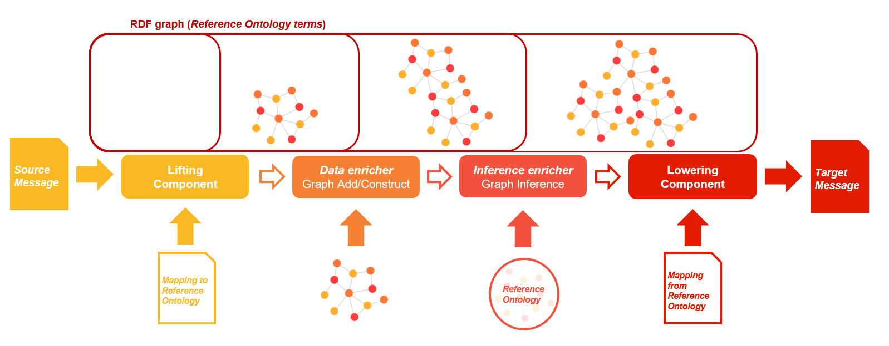
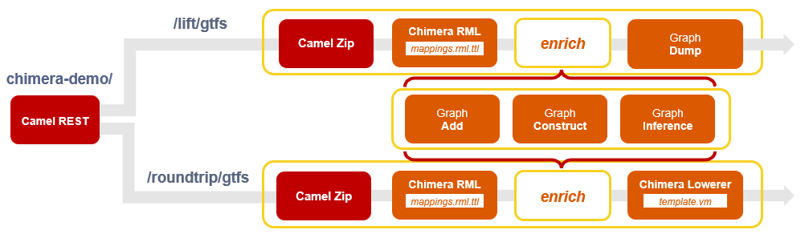

# Chimera Tutorial

The `chimera-tutorial` project offers a complete example to easily understand how to develop semantic data transformation pipelines using the [Chimera](https://github.com/cefriel/chimera) framework.

## TL;DR

1. Launch the `chimera-tutorial` pipelines with Docker
```
docker run -p 8888:8888 cefriel/chimera:tutorial
```
2. Follow the instructions in the [_Try it_ section](#try-it) to invoke the endpoints: (i) import the Postman collection, or (ii) run the `tutorial.sh` script with one of the following arguments: `lift`, `construct`, `conversion`, `enrich`, `load-enrich`, `inference`. 

[](https://app.getpostman.com/run-collection/d4136255a10b71a4fd2d)

3. An advanced tutorial for monitoring and scalability is available in [tutorial-advanced](tutorial-advanced).

## Chimera pipeline configuration

A standard Chimera pipeline can be composed of four blocks:

- *Lifting*: this block takes a structured message as input, and enriches the RDF graph with the triples obtained by applying mapping rules to the input.
- *Data enricher*: this block loads a set of RDF files, or generates a set of triples (e.g., SPARQL Construct query) and loads them into the RDF graph.
- *Inference enricher*: this block loads a set of ontology files into the RDF graph, inference rules can generate additional triples enriching the graph.
- *Lowering*: this block applies mapping rules to extract data from the RDF graph and produce a structured message as output.

<p align="left"></p>

The  `chimera-tutorial`  defines semantic data transformation pipelines considering a sample [GTFS](https://developers.google.com/transit/gtfs) feed as input and the [Linked GTFS](https://github.com/OpenTransport/linked-gtfs) vocabulary as the reference ontology.

The  `chimera-tutorial` exploits an in-memory RDF graph, however, Chimera can be configured to work with a remote Triplestore.

The  `chimera-tutorial` project is configured to expose multiple [Chimera pipelines](src/main/resources/routes/camel-context.xml) as different endpoints ([Camel Rest](https://camel.apache.org/components/3.15.x/rest-component.html) configuration):

- `/lift/gtfs`: RML mappings in the `lifting` folder are applied on the incoming GTFS feed through the `chimera-rml` block
- `/roundtrip/gtfs` defines a semantic converter for a roundtrip conversion:
  - RML mappings in the `lifting` folder are applied on the incoming GTFS feed through the `chimera-rml` block to materialise a KG, 
  - the Velocity+SPARQL template in the `lowering` folder are applied through the `chimera-rdf-lowerer` block to obtain back the `GTFS Stop` file.
- `/load`: allows loading an additional source that can later be used to enrich the KG during the conversion process.

The `/lift/gtfs` and `/roundtrip/gtfs/` routes accept the following option via HTTP Header

- `additional_source:<filename>`: enrich the KG before lowering with additional triples in the provided source 
- `inference:true`: apply inference using the provided [ontology](src/main/resources/ontology.owl) through the `chimera-graph-inference` block
- `construct:true`: apply the provided [SPARQL Construct query](src/main/resources/construct.ttl) to enrich the KG with additional triples through the `chimera-graph-construct` block

<p align="left"></p>

## Repository structure

Configuration

- `inbox` folder: contains the input files provided to test and validate the converter.
- `lifting` folder: contains the lifting mappings in both [YARRRML](https://w3id.org/yarrrml/spec/) and [RML](https://rml.io/specs/rml) syntax.
- `lowering` folder: contains the lowering template (`.vm`) using [VTL](https://velocity.apache.org/engine/1.7/vtl-reference.html).
- `outbox` folder: contains the expected results for the tutorial execution.

Source code

- `src` folder: contains the source code for the converter and the Chimera pipeline.
- `pom.xml`: pom for the Maven project of the converter.

Runtime

- `Dockerfile`: Dockerfile to build a containerized converter using the compiled Jar.
- `Dockerfile-compile`: Dockerfile to clone Chimera and build a containerized converter using a multi-stage build.
- `docker-compose.yml`: docker-compose configuration.
- `run.sh` : bash scripts specifying how to compile and/or run the converter using directly the Jar.
- `tutorial.sh`: CURL calls to execute the different steps of the tutorial.

## How to build and run

The `run.sh` bash script specifies how to run the converter using directly the Jar, the `docker-compose.yml` specifies how to build and run the converter using Docker. In both cases, the expected filesystem structure is configured before running the converter. For the Jar, a temporary folder is created during execution. For Docker, volumes are used to mount the files in the expected filesystem locations.

### How to run

To run the `chimera-tutorial`, if you have Docker installed, you can simply run the image from [DockerHub](https://hub.docker.com/repository/docker/cefriel/chimera-tutorial):
```
docker run -p 8888:8888 cefriel/chimera:tutorial
```
Otherwise:
1. clone or download the repository
2. download the Jar from the latest [release](https://github.com/cefriel/chimera-tutorial/releases) of the `chimera-tutorial`
3. add the Jar to a `target` folder.

You can run the Jar using `sh run.sh`or run your own Docker image using `docker-compose up`.

### How to configure

You can configure the `chimera-tutorial` without the need of rebuilding it, simply modify the files that are accessed at runtime (e.g., the lifting and lowering mappings). This is not possible using the already built image from DockerHub.

### How to build

The Chimera packages _chimera-core_, _chimera-rml_ and _chimera-rdf-lowerer_ should be installed (`mvn install`) in the local Maven repository to compile the converter prototype (imported through the `pom.xml` of the `chimera-tutorial` project). 

The Chimera source code is available in the Chimera repository on Github (Release v2.2 https://github.com/cefriel/chimera).

Run `sh run.sh --chimera` to clone the Chimera code and install the packages before compiling the Jar. Alternatively the `Dockerfile-deploy` file can be used for a multi-stage build using Docker. 
```
docker build -f Dockerfile-compile -t cefriel/chimera-tutorial .
```

To build only the `chimera-tutorial` project you can run `sh run.sh --build`.

## Try it

You can execute the tutorial following these instructions. Corresponding cURL command are available in the file `tutorial.sh`. A Postman collection is made available (once imported configure files from `inbox` folder in the request Body).

[](https://app.getpostman.com/run-collection/d4136255a10b71a4fd2d)

An advanced tutorial for monitoring and scalability is available in [tutorial-advanced](tutorial-advanced).

#### Lifting (`sh tutorial.sh lifting`)

Use the _RML lifter_ block to obtain a Linked GTFS representation of the `stops.txt` file in the sample GTFS feed.

```
POST http://localhost:8888/chimera-demo/lift/gtfs/ 
Attach the file inbox/sample-gtfs-feed.zip
```

#### Construct (`sh tutorial.sh construct`)

Use the _RML lifter_ block  to obtain a Linked GTFS representation of the `stops.txt` file in the sample GTFS feed and enrich it with triples generated from a an example [SPARQL Construct query](src/main/resources/construct.ttl).

```
POST http://localhost:8888/chimera-demo/roundtrip/gtfs/ 
Attach the file inbox/sample-gtfs-feed.zip
Add as header construct:true
```

#### Conversion (`sh tutorial.sh conversion`)

Use the _RML lifter_ block and the _rdf-lowerer_ block to obtain back a GTFS representation of the `stops.txt` file in the sample GTFS feed after a roundtrip through a Linked GTFS representation.

```
POST http://localhost:8888/chimera-demo/roundtrip/gtfs/ 
Attach the file inbox/sample-gtfs-feed.zip
```

#### Enrich (`sh tutorial.sh enrich`)

Use the _RML lifter_ block and the _rdf-lowerer_ block to obtain back an _enriched_ GTFS representation of a sample GTFS feed after a roundtrip through a Linked GTFS representation. In this example, we use the example data in [enrich.ttl](src/main/resources/enrich.ttl).

```
POST http://localhost:8888/chimera-demo/roundtrip/gtfs/ 
Attach the file inbox/sample-gtfs-feed.zip
Add as header additional_source:enrich.ttl
```

#### Load-Enrich (`sh tutorial.sh load-enrich`)

You can also use a different additional source using two steps:

1. Load an additional source, e.g., [my-source.ttl](inbox/my-source.ttl)
```
POST http://localhost:8888/chimera-demo/load/ 
For example, attach the file inbox/my-source.ttl
Add as header filename:my-source.ttl
```

2. Perform the enriched conversion
```
POST http://localhost:8888/chimera-demo/roundtrip/gtfs/ 
Attach the file inbox/sample-gtfs-feed.zip
Add as header additional_source:my-source.ttl
```

#### Inference (`sh tutorial.sh inference`)

Use the _RML lifter_ block and the _rdf-lowerer_ block to obtain back an _enriched_ GTFS representation of a sample GTFS feed after a roundtrip through a Linked GTFS representation and enabling RDFS inference. In this example, we use an example [ontology](src/main/resources/ontology.owl) defining an axiom for the definition of a `range` on the `gtfs:parentStation` property. Using the enricher block with data in the additional source, and enabling inference with that ontology, we can retrieve an additional `gtfs:Stop` in the lowering of the `stops.txt` file.

```
POST http://localhost:8888/chimera-demo/roundtrip/gtfs/ 
Attach the file inbox/sample-gtfs-feed.zip
Add as header 
    additional_source:enrich.ttl
    inference:true
```

### Notes

- The `InferenceEnricher` block enabled in this pipeline performs a one-time inference evaluation against the schema adding the resulting triples to the graph. To improve performances and guarantee inference throughout the entire pipeline, it is recommended to configure the `AttachGraph` block.
- Enrichment and Inference can also be applied using the same headers to the lifting route (http://localhost:8888/chimera-demo/lift/gtfs/)
